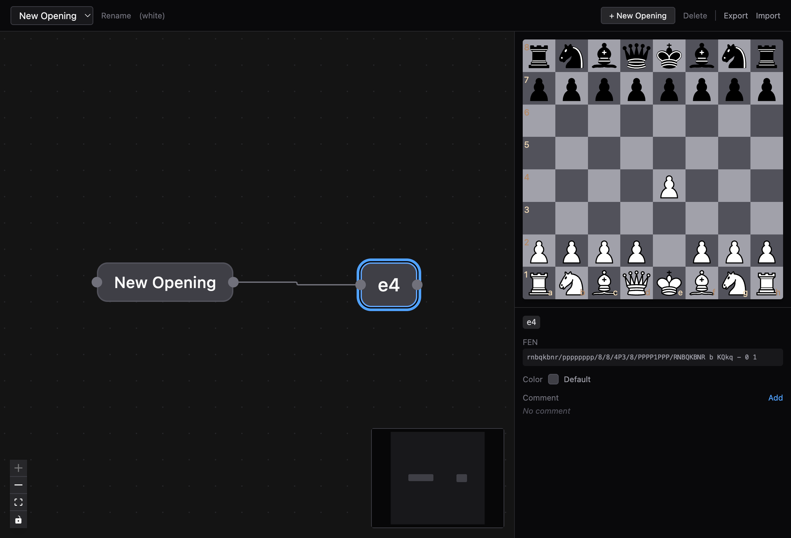
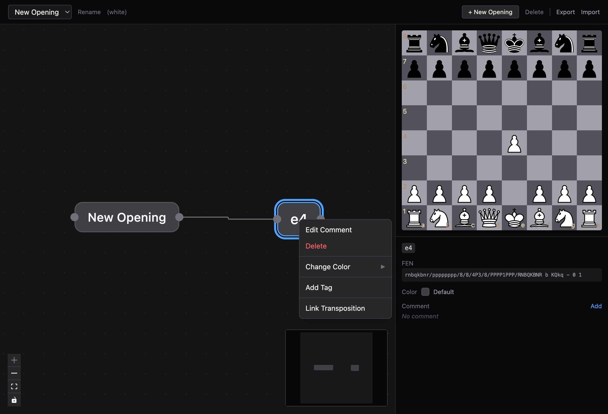

# Chess Graph

A chess opening repertoire builder that visualizes game trees as interactive node-based graphs. Explore variations, annotate positions, and build your repertoire visually.


## Features

- **Interactive graph view** — positions are nodes, moves are edges; drag, zoom, and navigate freely
- **Chessboard sync** — clicking a node updates the board; making a move on the board creates a new node
- **Multiple repertoires** — create, rename, export, and import opening repertoires
- **Node annotations** — add comments, tags, and colors to any position
- **Transposition linking** — connect nodes that reach the same position via different move orders
- **Context menu actions** — right-click nodes to edit, delete, change color, tag, or link transpositions
- **PGN import/export** — share repertoires as PGN files
- **Local persistence** — all data stored client-side in IndexedDB (no account required)
- **Minimap** — overview of the full graph in the corner





## Tech Stack

- [React 19](https://react.dev/) + [TypeScript](https://www.typescriptlang.org/) + [Vite 7](https://vite.dev/)
- [@xyflow/react](https://reactflow.dev/) — graph visualization
- [react-chessboard](https://github.com/Clariity/react-chessboard) — interactive chess board
- [chess.js](https://github.com/jhlywa/chess.js) — move validation and game state
- [dagre](https://github.com/dagrejs/dagre) — automatic graph layout
- [dexie](https://dexie.org/) — IndexedDB wrapper for local persistence
- [Tailwind CSS v4](https://tailwindcss.com/)

## Getting Started

```bash
# Clone the repository
git clone https://github.com/NicoDeGiacomo/chess-graph.git
cd chess-graph

# Install dependencies
npm install

# Start the dev server
npm run dev
```

Open [http://localhost:5173](http://localhost:5173) in your browser.

## Scripts

| Command | Description |
|---------|-------------|
| `npm run dev` | Start development server |
| `npm run build` | Type-check and build for production |
| `npm run lint` | Run ESLint |
| `npm run preview` | Preview production build |
| `npm test` | Run unit tests (Vitest) |
| `npm run test:watch` | Run unit tests in watch mode |
| `npm run test:e2e` | Run end-to-end tests (Playwright) |

## Project Structure

```
src/
├── components/       # React components
│   ├── ChessboardPanel.tsx   # Chess board with move handling
│   ├── GraphCanvas.tsx       # Main graph view (React Flow)
│   ├── MoveNode.tsx          # Custom node component for moves
│   ├── NodeDetails.tsx       # Side panel showing position details
│   ├── ContextMenu.tsx       # Right-click menu on nodes
│   ├── Sidebar.tsx           # Left sidebar
│   ├── TopBar.tsx            # Top navigation bar
│   ├── EditNodeDialog.tsx    # Dialog for editing node properties
│   └── LinkTranspositionDialog.tsx  # Dialog for linking transpositions
├── hooks/
│   ├── useRepertoire.tsx     # Core state management for repertoire data
│   └── useGraphLayout.ts    # Dagre-based graph layout logic
├── db/               # Dexie database schema and operations
├── types/            # TypeScript type definitions
├── App.tsx           # Root application component
└── main.tsx          # Entry point
```

## License

[MIT](LICENSE)
